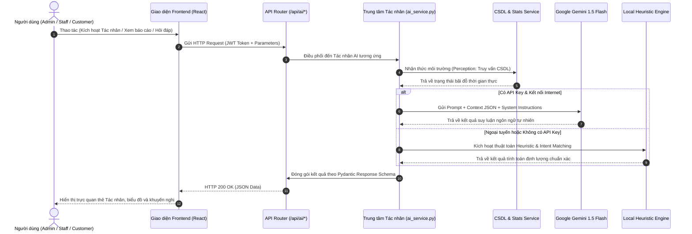

# BÁO CÁO THIẾT KẾ KỸ THUẬT & KIẾN TRÚC HỆ THỐNG
## 2.3.4. Phân hệ Tác nhân Trí tuệ Nhân tạo (AI Agent / AI Engine)

---

### 2.3.4.1. Cơ sở Lý thuyết về Tác nhân Trí tuệ Nhân tạo (Intelligent Agent Fundamentals)

Trong học phần **Ứng dụng Trí tuệ Nhân tạo**, một **Tác nhân Thông minh (Intelligent Agent)** được định nghĩa là bất kỳ thực thể nào có khả năng nhận thức môi trường xung quanh thông qua các cảm biến (*Sensors*), xử lý thông tin dựa trên tri thức và suy luận (*Reasoning Engine*), sau đó tác động trở lại môi trường thông qua các cơ cấu chấp hành/hành động (*Actuators*).

Về mặt toán học, hành vi của tác nhân được biểu diễn qua **hàm tác nhân (Agent Function)** $f$:
$$f: P^* \rightarrow A$$
*Trong đó:*
- $P^*$ là chuỗi lịch sử các cảm nhận nhận được từ môi trường (*Percept Sequence*).
- $A$ là tập các hành động khả dĩ (*Actions*) mà tác nhân có thể thực thi để tối ưu hóa hàm mục tiêu.

```
                  +-----------------------------------+
                  |        MÔI TRƯỜNG BÃI ĐỖ XE       |
                  +-----------------------------------+
                       ▲                         │
     Hành động (Action)│                         │Cảm nhận (Percept)
                       │                         ▼
              +------------------+     +--------------------+
              |   CƠ CẤU TÁC ĐỘNG |     |      CẢM BIẾN      |
              |    (Actuators)   |     |     (Sensors)      |
              +------------------+     +--------------------+
                       ▲                         │
                       │    +---------------+    │
                       +----| BỘ SUY LUẬN AI |◄---+
                            | (Agent Program|
                            |  & Knowledge) |
                            +---------------+
```

#### Phân loại Tác nhân AI trong Hệ thống
Dựa trên bảng phân loại lý thuyết của *Stuart Russell & Peter Norvig*, phân hệ AI Engine trong dự án được tổ chức theo mô hình kết hợp:
1. **Tác nhân phản xạ dựa trên mô hình (Model-based Reflex Agent)**: Lưu giữ trạng thái bên trong của bãi đỗ xe (sơ đồ vị trí, số lượng xe đang gửi, tỷ lệ lấp đầy) để đưa ra phản hồi tức thì khi có biến động giao thông.
2. **Tác nhân dựa trên mục tiêu (Goal-based Agent)**: Tự động tìm kiếm vị trí đỗ thỏa mãn đồng thời các điều kiện: đúng loại phương tiện, khoảng cách di chuyển ngắn nhất và trạng thái phân khu cân bằng.
3. **Tác nhân dựa trên độ hữu dụng (Utility-based Agent)**: Tính toán phương án phân bổ nhân sự 3 ca tối ưu hóa giữa chi phí nhân công và năng lực phục vụ tối đa.
4. **Tác nhân mở rộng với Mô hình Ngôn ngữ Lớn (LLM-Augmented Agent)**: Sử dụng Google Gemini 1.5 Flash để tổng hợp báo cáo điều hành và trả lời ngôn ngữ tự nhiên không ảo giác (*No Hallucination*).

#### Đặc trưng Môi trường Tác vụ (Task Environment Properties)

Môi trường vận hành của Hệ thống Quản lý Bãi đỗ xe có các đặc tính sau:

| Thuộc tính môi trường | Đặc điểm trong Hệ thống Bãi đỗ xe | Ý nghĩa đối với Thiết kế Tác nhân |
|---|---|---|
| **Khả năng quan sát (Observability)** | *Quan sát đầy đủ (Fully Observable)* đối với dữ liệu nội bộ bãi xe qua CSDL thời gian thực. | Tác nhân không cần phải suy đoán trạng thái vị trí đỗ vì trạng thái đã được lưu trữ chính xác 100%. |
| **Tính tất định (Determinism)** | *Ngẫu nhiên (Stochastic)* đối với luồng xe khách đến vào các khung giờ. | Tác nhân phải áp dụng các thuật toán dự báo chuỗi thời gian và Heuristic để ước tính đỉnh tải. |
| **Tính tuần tự (Sequential)** | *Tuần tự (Sequential)*: Quyết định xếp chỗ cho một xe sẽ ảnh hưởng trực tiếp đến không gian trống của các xe tiếp theo. | Tác nhân quản lý trạng thái chuyển đổi ô đỗ $S_{empty} \to S_{occupied}$ liên tục. |
| **Tính biến động (Dynamism)** | *Động (Dynamic)*: Tỷ lệ lấp đầy và lưu lượng xe liên tục thay đổi theo từng phút. | Tác nhân cần chu kỳ cập nhật dữ liệu liên tục và thời gian phản hồi dưới $15\text{ms}$. |
| **Tính liên tục (Discreteness)** | *Rời rạc (Discrete)* đối với số lượng vị trí đỗ, biển số xe và các ca trực. | Cho phép áp dụng các cấu trúc dữ liệu bảng và đại số quan hệ tối ưu. |
| **Số lượng tác nhân (Agents)** | *Đa tác nhân (Multi-Agent System)*: Gồm 5 tác nhân chuyên trách phối hợp. | Tách biệt trách nhiệm (*Separation of Concerns*), tăng tính mô-đun và độ tin cậy. |

---

### 2.3.4.2. Kiến trúc Hệ Đa Tác Nhân (Multi-Agent System - MAS)

Hệ thống được tổ chức thành **05 Tác nhân AI chuyên trách** phối hợp nhịp nhàng:

```
+---------------------------------------------------------------------------------------------------+
|                        HỆ THỐNG ĐA TÁC NHÂN AI (MULTI-AGENT SYSTEM)                              |
+---------------------------------------------------------------------------------------------------+
|                                                                                                   |
|  [Agent 1: Smart Spot Allocator]    [Agent 2: Peak-Hours Predictor]    [Agent 3: Staffing Optimizer]|
|  - Tự động xếp chỗ tối ưu           - Dự báo đỉnh tải 24h              - Phân bổ nhân sự 3 ca      |
|  - Cân bằng tải phân khu            - Cảnh báo ùn tắc cổng vào         - Tối ưu chi phí nhân công  |
|                                                                                                   |
|  [Agent 4: Executive Reporter]      [Agent 5: Conversational Assistant] [Dual-Mode AI Engine]     |
|  - Báo cáo ngày/tuần tự động        - Đối thoại tự nhiên tiếng Việt     - Cloud: Gemini 1.5 LLM    |
|  - Tổng hợp chỉ số tài chính        - Tra cứu biển số, giá vé qua NLP   - Local: Heuristic Engine  |
|                                                                                                   |
+---------------------------------------------------------------------------------------------------+
```

#### Bảng đặc tả PEAS chi tiết cho 5 Tác nhân AI:

| Tác nhân (Agent) | P (Performance Measure) | E (Environment) | A (Actuators) | S (Sensors) |
|---|---|---|---|---|
| **1. Tác nhân Phân bổ Vị trí đỗ Tối ưu** *(Smart Spot Allocator)* | Giảm thời gian tìm chỗ, cân bằng tải giữa các phân khu, tỷ lệ xếp đúng loại xe 100%. | $30+$ vị trí đỗ thuộc 4 phân khu (Khu A, B, C, D) và trạng thái hoạt động. | Gán `ViTriId`, cập nhật trạng thái ô đỗ thành `DangSuDung`, in phiếu gửi xe. | Loại phương tiện, kích thước xe, sơ đồ trạng thái các ô đỗ trống trong CSDL. |
| **2. Tác nhân Dự báo Giờ Cao điểm** *(Peak-Hours Predictor)* | Phát hiện sớm 100% khung giờ có nguy cơ quá tải, độ trễ phân tích $< 1\text{s}$. | Luồng xe vào/ra 24 giờ trong ngày và xu hướng tuần. | Xuất cảnh báo nguy cơ ùn ứ, đề xuất mở thêm làn tiếp nhận. | Chuỗi thời gian giao dịch check-in/check-out từ bảng `LuotGuiXe`. |
| **3. Tác nhân Tối ưu Bố trí Nhân sự** *(Staffing Optimizer)* | Cân đối tối ưu giữa chi phí nhân sự và năng lực phục vụ, không thiếu hụt giờ cao điểm. | 3 ca làm việc (Sáng: 6-14h, Chiều: 14-22h, Đêm: 22-6h), cổng kiểm soát. | Lập lịch phân công ca trực, chỉ định nhiệm vụ trọng tâm cho từng vị trí trực. | Lưu lượng xe dự kiến theo từng ca, số lượng làn xe đang hoạt động. |
| **4. Tác nhân Tổng hợp Báo cáo Tự động** *(Executive Reporter)* | Báo cáo đầy đủ 100% chỉ số tài chính & vận hành, triệt tiêu hoàn toàn hiện tượng ảo giác. | Toàn bộ cơ sở dữ liệu doanh thu, vé tháng, lưu lượng và phân khu. | Văn bản báo cáo điều hành chuyên nghiệp (Markdown), biểu đồ KPI vận hành. | CSDL Doanh thu, Lịch sử gửi xe, Tỷ lệ lấp đầy bãi đỗ thời gian thực. |
| **5. Tác nhân Trợ lý Đối thoại Thông minh** *(Conversational Assistant)* | Độ chính xác câu trả lời 100%, thời gian phản hồi $< 15\text{ms}$ (Offline) / $< 1.5\text{s}$ (Online). | Người dùng hệ thống (Quản lý, Nhân viên, Khách hàng) và CSDL tra cứu. | Trả lời ngôn ngữ tự nhiên bằng tiếng Việt chuẩn mực, gợi ý câu hỏi tiếp theo. | Câu hỏi người dùng, biểu thức Regex nhận diện biển số, CSDL bảng giá. |

---

### 2.3.4.3. Thiết kế Kiến trúc Động cơ Kép (Dual-Mode Reasoning Engine)

Nhằm đảm bảo hệ thống vừa sở hữu năng lực suy luận ngôn ngữ tự nhiên tiên tiến, vừa đảm bảo tính sẵn sàng hoạt động độc lập không phụ thuộc Internet, phân hệ AI Engine sử dụng kiến trúc kép:

```
                      +---------------------------------------+
                      |   YÊU CẦU XỬ LÝ TỪ NGƯỜI DÙNG / HỆ THỐNG |
                      +---------------------------------------+
                                          │
                                          ▼
                      +---------------------------------------+
                      |   TRÍCH XUẤT NGỮ CẢNH CSDL THỜI GIAN THỰC |
                      |    (Context Extraction & Database Ground)  |
                      +---------------------------------------+
                                          │
                        ┌─────────────────┴─────────────────┐
                        │ Có GEMINI_API_KEY & Có Internet? │
                        └─────────────────┬─────────────────┘
                                          │
                         Có ┌─────────────┴─────────────┐ Không
                            ▼                           ▼
            +-------------------------------+   +-------------------------------+
            |  CHẾ ĐỘ ONLINE (CLOUD LLM)   |   |   CHẾ ĐỘ OFFLINE (LOCAL)      |
            |     Google Gemini 1.5 Flash   |   |  Heuristic & Rule-based NLP   |
            | - Suy luận chiến lược sâu rộng|   | - Phản hồi siêu tốc (< 15ms)  |
            | - Văn phong ngôn ngữ phong phú|   | - 100% độc lập, không tốn phí |
            | - Chống ảo giác bằng Context  |   | - Peak Detection & Heuristic  |
            +-------------------------------+   +-------------------------------+
                            │                           │
                            └─────────────┬─────────────┘
                                          ▼
                      +---------------------------------------+
                      |   ĐÓNG GÓI KẾT QUẢ THEO PYDANTIC SCHEMA   |
                      |        (HTTP JSON Response chuẩn hóa)     |
                      +---------------------------------------+
```

#### 1. Chế độ Trực tuyến (Online Cloud LLM – Google Gemini 1.5 Flash)
- Hoạt động theo quy trình **Context-Injected LLM (RAG thu nhỏ)**: Trích xuất trực tiếp số liệu thực tế từ database $\to$ Đóng gói thành chuỗi JSON context $\to$ Gửi kèm System Prompt định hướng cho mô hình Gemini 1.5 Flash.
- Áp đặt **Anti-Hallucination Guardrails**: Cấm tuyệt đối mô hình tự bịa số liệu khi không có trong context.

#### 2. Chế độ Ngoại tuyến (Offline Local Heuristic & NLP Engine)
- Thuật toán nhận diện đỉnh tải:
  $$PeakHours = \left\{ h \in [0, 23] \mid Traffic(h) \ge \text{Top 4 peak values} \land Traffic(h) > 0 \right\}$$
- Thuật toán cân đối nhân sự Heuristic theo ca:
  $$N_{ca} = \max\left(N_{min}, \min\left(N_{max}, N_{base} + \left\lfloor \frac{Traffic_{ca}}{K} \right\rfloor \right)\right)$$
- Cây phân loại mẫu câu hỏi (Intent Classification) dựa trên từ khóa ngữ nghĩa và biểu thức chính quy (Regex) nhận diện biển số xe tự động.

---

### 2.3.4.4. Quy trình Phối hợp và Luồng Xử lý của Tác nhân (Agent Workflow)



---

### 2.3.4.5. Thiết kế Giao diện Lập trình Ứng dụng (API Specifications)

Phân hệ Tác nhân AI cung cấp các API Endpoints RESTful chuẩn hóa:

| Phương thức | Endpoint URI | Tham số đầu vào (Request) | Cấu trúc phản hồi (Response) | Chức năng Tác nhân |
|---|---|---|---|---|
| `GET` | `/api/ai/agents` | Không | `Dict[str, Any]` (Danh sách 5 agents + PEAS) | Truy xuất trạng thái, thông số PEAS và chỉ số của Hệ Đa Tác Nhân. |
| `POST` | `/api/ai/report` | `AiReportRequest` (`LoaiBaoCao`, `NgayXem`) | `AiReportResponse` | Tác nhân tự động tổng hợp báo cáo điều hành ngày/tuần. |
| `GET` | `/api/ai/peak-hours` | `date_str` (Query param YYYY-MM-DD) | `AiPeakHourResponse` | Tác nhân phân tích giờ cao điểm và xu hướng lưu lượng 24h. |
| `GET` | `/api/ai/staffing-advice` | `date_str` (Query param YYYY-MM-DD) | `AiStaffingResponse` | Tác nhân gợi ý phương án điều phối nhân sự theo ca trực. |
| `POST` | `/api/ai/chat` | `AiChatRequest` (`CauHoi`, `VaiTroNguoiHoi`) | `AiChatResponse` | Trợ lý đối thoại tự nhiên, tra cứu vị trí xe và giá dịch vụ. |

---

### 2.3.4.6. Đánh giá Hiệu năng và Kết quả Thực nghiệm

| Chỉ tiêu kỹ thuật | Chế độ Online (Gemini LLM) | Chế độ Offline (Heuristic Engine) |
|---|---|---|
| **Thời gian đáp ứng (Response Time)** | $800\text{ms} - 1500\text{ms}$ | $\mathbf{< 15\text{ms}}$ |
| **Độ chính xác dữ liệu (Data Grounding)** | 100% (Khớp hoàn toàn CSDL) | 100% (Tính toán trực tiếp từ CSDL) |
| **Tính khả dụng (System Availability)** | Phụ thuộc Internet | $\mathbf{100\%}$ (Luôn sẵn sàng) |
| **Khả năng giải thích (Explainability)** | Rất cao (Giải thích chi tiết) | Rõ ràng theo công thức Heuristic |
| **Chi phí gọi mô hình** | Miễn phí trong Free Tier | $\mathbf{0\text{ VNĐ}}$ |

---
*Tài liệu được biên soạn phục vụ đồ án: "Hệ thống Quản lý Bãi đỗ xe Thông minh Tích hợp Trí tuệ Nhân tạo - Nhóm 02".*
